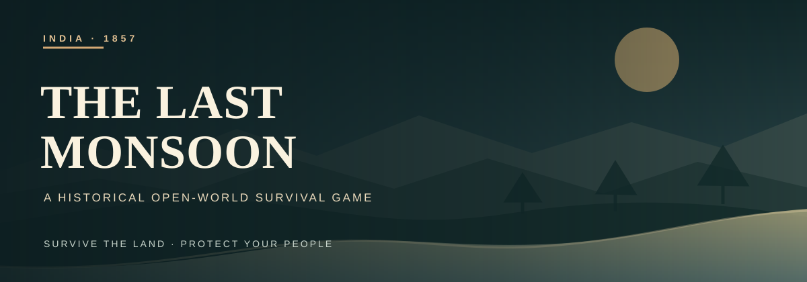
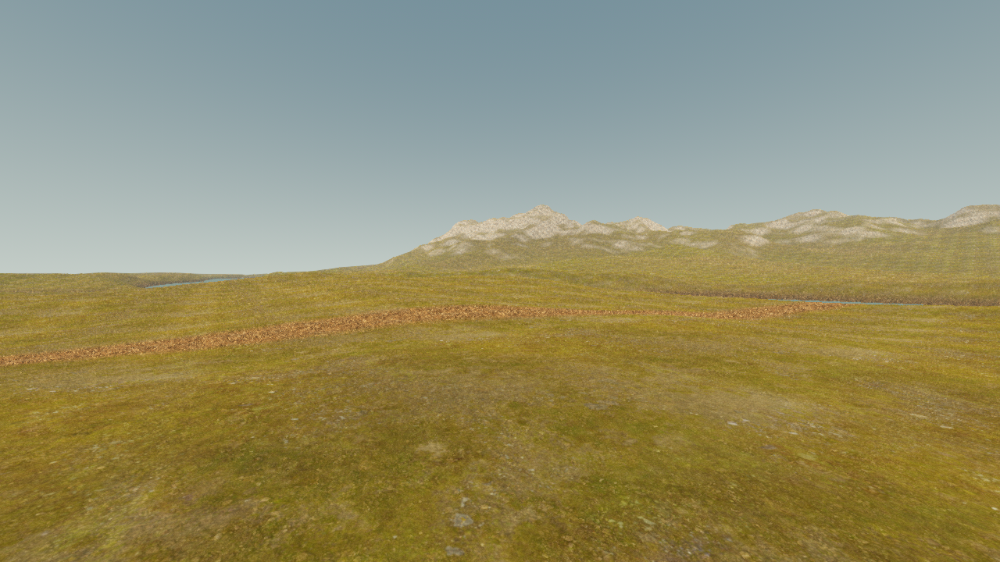
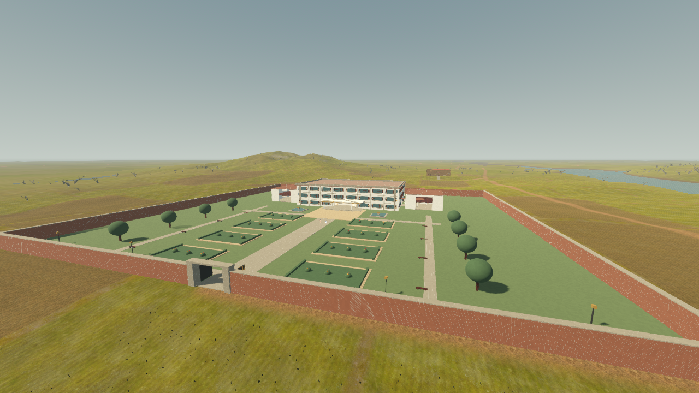

<div align="center">

**A third-person historical survival game built with Godot and GDScript**

`PRE-ALPHA` · `ACTIVE DEVELOPMENT` · `DESKTOP PROTOTYPE`

[Explore the world](#project-status) · [Run the project](#getting-started) · [Controls](#controls) · [Development roadmap](#development-roadmap)

</div>

## Overview

**The Last Monsoon** is a third-person historical open-world survival game set in a fictional region of North/Central India during the period surrounding the uprising of **1857**.

The player follows **Arjun**, a young villager whose search for his missing brother gradually draws him into a wider conflict involving survival, displacement, resistance, military occupation, local communities, and the changing political landscape of the region.

The project is being designed around one core principle:

> **Build a smaller world with meaningful systems before building a larger world with shallow content.**

The game is currently in **pre-alpha**, with development focused on reusable gameplay architecture and a playable vertical slice.

For current work, failures and the next command, use the short [handoff](CODEX_HANDOFF.md). The [documentation index](docs/README.md) links to focused systems and evidence. This README describes the game and long-term direction; it is not the live task log.

---

## Project Status

> [!IMPORTANT]
> **Pre-alpha engineering prototype.** Systems and visual candidates are under active review. The [current handoff](CODEX_HANDOFF.md) tracks acceptance, failures, and next actions; the [documentation index](docs/README.md) links to detailed evidence.

### Landscape foundation — Suryagarh

The default playable scene is now `res://world/suryagarh/suryagarh_world.tscn`.
It contains a **1,728 × 1,728 metre landscape (2.986 km²)** with agricultural plains,
a meandering river corridor, rocky eastern hills, initial broadleaf vegetation,
dirt routes, and terrain reservations for future settlements. The original
`world/test_world.tscn` remains available as the small systems test scene.

This is a prototype world with swimming, an initial climb system, settlements,
flags and a river boat under development. Their presence does not imply finished
art, traversal, performance or story content. The current acceptance state is
recorded in the handoff and focused validation reports.

**Minimum-memory design target: 8 GB RAM.** Defaults use 720p, 1K natural textures,
mesh LOD, spatially batched vegetation and limited shadows. Performance has to be
validated on actual minimum hardware; an M4 with 16 GB does not certify all 8 GB devices.

Arjun’s current runtime appearance was rejected in visual review. Likeness, motion,
and equipment contact remain open; see the [review note](docs/characters/arjun/rejection_2026-09-23.md). A timber pile
bridge with braced rails and walkable bank ramps crosses the river at the river
approach (z = 165 m). Press **M** for the north-up field map; zoom, pan and place
a map marker with the pointer. **M** or **Esc** closes it.

Press **F5** to run the new default world. In development builds, **F3** toggles an
aerial survey and **F4** moves between landscape review locations.

See the [documentation index](docs/README.md) and
[third-party landscape licenses](docs/world/ASSET_LICENSES.md).

### At a glance

| Area | In the prototype | Still in review |
|:---|:---|:---|
| **World** | 2.986 km² Suryagarh landscape, Bhairavpur, civic interiors, Government House | Traversal, visual quality, and 8 GB performance |
| **Play** | Movement, survival, river water, riding, combat, map, save and load | Animation, contact, balance, and final content |
| **Characters** | Arjun runtime candidate; village and British NPC blockouts | Arjun appearance [rejected](docs/characters/arjun/rejection_2026-09-23.md); NPC clothing and motion unapproved |
| **Input** | Keyboard and mouse; DualSense mappings, settings, feedback paths | Physical controller playthrough |

The detailed limits and evidence for each area are in the [documentation index](docs/README.md).

### Implemented

| System | Status |
|---|---|
| Third-person movement | ✅ Implemented |
| Walking | ✅ Implemented |
| Sprinting | ✅ Implemented |
| Jumping | ✅ Implemented |
| Gravity | ✅ Implemented |
| Player collision | ✅ Implemented |
| Third-person camera | ✅ Implemented |
| Spring-arm camera collision | ✅ Implemented |
| Mouse camera control | ✅ Implemented |
| Interaction ray | ✅ Implemented |
| Interaction prompts | ✅ Implemented |
| Reusable interactable architecture | ✅ Implemented |
| Health | ✅ Prototype |
| Stamina | ✅ Prototype |
| Hunger | ✅ Prototype |
| Thirst | ✅ Prototype |
| Stamina exhaustion | ✅ Prototype |
| Starvation damage | ✅ Prototype |
| Dehydration damage | ✅ Prototype |
| Survival debug HUD | ✅ Prototype |

---

## Game Vision

The Last Monsoon combines:

- historical fiction
- open-world exploration
- survival mechanics
- systemic gameplay
- horse-based travel
- NPC relationships
- resistance operations
- settlement development
- faction reputation
- environmental storytelling
- dynamic world events

The game is not intended to make the player an unstoppable action hero.

Combat, travel, food, water, weather, injuries, information, relationships, and preparation are intended to have meaningful consequences.

---

## Setting

### Period

The game is set primarily around:

**1856–1859**

This allows the story to exist around the upheaval of 1857 while following fictional characters and fictional local events.

### Region

The primary setting is the fictional region of:

## Suryagarh

The region is inspired by environments found across North and Central India.

Planned environments include:

```text
Suryagarh
│
├── Bhairavpur Village
│
├── Agricultural Lands
│
├── Forest Region
│
├── River Settlements
│
├── Trading Town
│
├── Suryagarh City
│
├── Military Cantonment
│
├── Old Fort
│
├── Rural Settlements
│
└── Regional Roads & Trails
```

Using a fictional region allows the project to preserve historical atmosphere without presenting fictional local events as documented history.

---

## Protagonist

### Arjun

Arjun does not begin the story as a resistance fighter.

He begins as an ordinary young man living with his family in Bhairavpur.

His older brother, **Dev**, serves as a sepoy and later disappears.

Arjun's first major objective is simple:

> **Find Dev.**

His journey gradually exposes him to the expanding conflict and forces him to decide how deeply he is willing to become involved.

---

## Core Design Pillars

### 1. Survival

The environment should create problems rather than simply decorate the world.

Planned systems include:

- hunger
- thirst
- health
- stamina
- exhaustion
- injuries
- bleeding
- disease
- body temperature
- wetness
- sleep
- food quality
- water safety

---

### 2. Exploration

Exploration should provide meaningful discoveries rather than checklist activities.

Potential locations include:

- villages
- farms
- forests
- forts
- rivers
- temples
- mosques
- markets
- ghats
- cantonments
- military camps
- abandoned structures
- workshops
- caves
- hidden trails
- resistance camps

---

### 3. Systemic World

Game systems should influence one another.

Example:

```text
Heavy Rain
    ↓
River Level Increases
    ↓
Crossing Becomes Dangerous
    ↓
Trade Route Is Disrupted
    ↓
Village Supplies Decrease
```

Another example:

```text
Player Attacks Supply Route
    ↓
Regional Supplies Decrease
    ↓
Military Response Increases
    ↓
Additional Patrols Appear
    ↓
Travel Becomes More Dangerous
```

---

### 4. Survival Before Combat

Fighting should not always be the best solution.

The player may instead:

- hide
- retreat
- negotiate
- disguise themselves
- avoid patrols
- use alternate routes
- wait for night
- gather intelligence
- create distractions

---

### 5. Consequence

Actions should influence:

- NPC relationships
- settlements
- factions
- patrol activity
- regional security
- trade
- available resources
- player identity
- story outcomes

---

## Technical Stack

| Area | Technology |
|---|---|
| Engine | Godot Engine |
| Gameplay Language | GDScript |
| 3D Modelling | Blender |
| Animation | Blender / Godot |
| Version Control | Git |
| Repository Hosting | GitHub |

---

## Architecture

The project uses modular gameplay systems rather than placing all behavior inside a single Player script.

Current architecture:

```text
Player
│
├── PlayerController
│   ├── Input
│   ├── Movement
│   ├── Camera
│   └── Interaction Detection
│
├── SurvivalComponent
│   ├── Health
│   ├── Stamina
│   ├── Hunger
│   └── Thirst
│
├── Interaction
│   ├── Ray Detection
│   ├── Prompt
│   └── Interactable Interface
│
└── UI
    ├── Interaction Prompt
    └── Survival Debug Display
```

The long-term objective is to keep major gameplay domains independent:

```text
Player
World
Interaction
Survival
Inventory
Items
Characters
AI
Horses
Combat
Factions
Quests
Settlements
Weather
Time
Save System
World Streaming
Developer Tools
```

---

## Repository Structure

Current structure:

```text
res://
│
├── player/
│   ├── player.tscn
│   └── player_controller.gd
│
├── interaction/
│   ├── interactable.gd
│   └── test_interactable.gd
│
├── survival/
│   └── survival_component.gd
│
└── world/
    └── test_world.tscn
```

Target structure as development expands:

```text
res://
│
├── core/
│   ├── managers/
│   ├── events/
│   ├── save/
│   └── configuration/
│
├── player/
│   ├── components/
│   ├── scenes/
│   ├── animation/
│   └── controller/
│
├── characters/
│   ├── npc/
│   ├── enemies/
│   └── animals/
│
├── interaction/
│
├── survival/
│
├── inventory/
│
├── items/
│
├── equipment/
│
├── combat/
│
├── horses/
│
├── factions/
│
├── quests/
│
├── settlements/
│
├── world/
│   ├── regions/
│   ├── environments/
│   ├── weather/
│   ├── time/
│   └── streaming/
│
├── ui/
│
├── audio/
│
├── data/
│
├── assets/
│
└── dev/
```

The structure may evolve as production requirements become clearer.

---

## Controls

Current development controls:

| Action | Input |
|---|---|
| Forward | `W` |
| Backward | `S` |
| Left | `A` |
| Right | `D` |
| Sprint | `Left Shift` |
| Jump | `Space` |
| Interact / drink at a riverbank | `E` |
| Fill the carried water pouch at a riverbank | `Shift+E` |
| Camera | `Mouse` |
| Pause menu (save, load, settings, main menu) | `Esc` |
| Field map | `M` |

Settings offer Auto, Keyboard + Mouse, and PS5 DualSense input modes. See the [controller guide](docs/world/animal_tools_and_controller.md) for the current button map and hardware review status. Player-defined input remapping is planned for a later stage.

---

## Getting Started

### Requirements

Install:

- Godot Engine
- Git

Blender is only required for 3D asset development.

---

### Clone the Repository

```bash
git clone <repository-url>
cd the-last-monsoon
```

---

### Open the Project

Launch Godot.

Select:

```text
Import Existing Project
```

Choose the project directory.

Godot should detect:

```text
project.godot
```

Open the project.

---

### Run the Landscape

Press **F5** to open the title menu. **Play Game** starts Suryagarh; **Continue** restores the newest of three local save slots, while **Load Game** lets you choose a slot. In the world, press **Esc** to save, load, or change sound, mouse, display, and VSync settings. Save files live in Godot's local `user://saves` directory.

### Run the Original Systems Prototype

Open:

```text
res://world/test_world.tscn
```

Run the current scene.

Default shortcut:

```text
F6
```

---

## Development Roadmap

### Milestone 0 — Project Foundation

- [x] Project initialization
- [x] Repository structure
- [x] Input configuration
- [x] Player scene
- [x] Test environment

---

### Milestone 1 — Player Controller

- [x] Third-person movement
- [x] Walking
- [x] Sprinting
- [x] Jumping
- [x] Gravity
- [x] Collision
- [x] Third-person camera
- [x] Camera collision

---

### Milestone 2 — Interaction Framework

- [x] Ray-based interaction
- [x] Dynamic prompts
- [x] Reusable interactable class
- [x] Test interactable
- [ ] Door interaction
- [ ] Water source interaction
- [ ] Item interaction
- [ ] NPC interaction
- [ ] Horse interaction

---

### Milestone 3 — Survival Foundation

- [x] Health
- [x] Stamina
- [x] Hunger
- [x] Thirst
- [x] Exhaustion
- [x] Starvation damage
- [x] Dehydration damage
- [ ] Drinking
- [ ] Eating
- [ ] Injuries
- [ ] Bleeding
- [ ] Sleep
- [ ] Temperature
- [ ] Wetness
- [ ] Disease

---

### Milestone 4 — Inventory & Items

- [ ] Item data architecture
- [ ] World pickups
- [ ] Player inventory
- [ ] Weight
- [ ] Item stacking
- [ ] Containers
- [ ] Equipment
- [ ] Consumables
- [ ] Horse storage

---

### Milestone 5 — Environmental Survival

- [ ] Day/night cycle
- [ ] Weather system
- [ ] Rain
- [ ] Temperature
- [ ] Campfires
- [ ] Cooking
- [ ] Water collection
- [ ] Safe sleeping

---

### Milestone 6 — Bhairavpur Vertical Slice

- [ ] Village blockout
- [ ] Farms
- [ ] Well
- [ ] River
- [ ] Forest
- [ ] Roads
- [ ] Market
- [ ] Stable
- [ ] Military checkpoint
- [ ] Initial NPC population

---

### Milestone 7 — Character Systems

- [ ] Final Arjun model
- [ ] Skeleton
- [ ] Animation controller
- [ ] Idle
- [ ] Walk
- [ ] Run
- [ ] Jump
- [ ] Interaction animations
- [ ] NPC framework
- [ ] NPC schedules
- [ ] NPC relationships

---

### Milestone 8 — Horse System

- [ ] Horse AI
- [ ] Mounting
- [ ] Dismounting
- [ ] Riding controller
- [ ] Horse stamina
- [ ] Horse health
- [ ] Horse hunger
- [ ] Horse thirst
- [ ] Horse trust
- [ ] Horse inventory

---

### Milestone 9 — Combat

- [ ] Combat state
- [ ] Melee
- [ ] Blocking
- [ ] Dodging
- [ ] Weapon equipment
- [ ] Damage system
- [ ] Period firearms
- [ ] Reloading
- [ ] Ammunition
- [ ] Enemy combat AI

---

### Milestone 10 — Living World

- [ ] Wildlife
- [ ] Factions
- [ ] Reputation
- [ ] Dynamic encounters
- [ ] Witnesses
- [ ] Identity tracking
- [ ] Wanted system
- [ ] Trade simulation
- [ ] Regional consequences

---

### Milestone 11 — Story Systems

- [ ] Quest framework
- [ ] Dialogue framework
- [ ] Opening mission
- [ ] Dev storyline
- [ ] Resistance storyline
- [ ] Settlement progression
- [ ] World-state consequences
- [ ] End-state system

---

## First Vertical Slice

The first production-quality playable area will focus on:

```text
Bhairavpur
    │
    ├── Village
    │
    ├── Farms
    │
    ├── Well
    │
    ├── Stable
    │
    ├── River
    │
    ├── Forest
    │
    ├── Dirt Road
    │
    └── Military Checkpoint
```

Target content:

- 8–12 buildings
- approximately 10–15 NPCs
- one functional horse
- food and water gameplay
- basic inventory
- basic day/night cycle
- environmental survival
- NPC interaction
- one checkpoint
- opening story mission

The purpose of the vertical slice is to prove that the core gameplay loop is enjoyable before expanding the world.

---

## Opening Gameplay Loop

The initial playable sequence is planned around an ordinary morning in Bhairavpur.

```text
Wake Up
   ↓
Speak With Family
   ↓
Prepare Supplies
   ↓
Visit Stable
   ↓
Travel Toward Market
   ↓
Interact With Villagers
   ↓
Return Home
   ↓
World Begins To Change
```

The sequence doubles as the game's introduction to:

- movement
- interaction
- inventory
- navigation
- horse riding
- trading
- survival

without relying heavily on explicit tutorial prompts.

---

## Development Principles

### Systems Before Scale

A functioning village is more valuable than an unfinished province.

### Gameplay Before Final Art

Prototype geometry is acceptable until core mechanics prove themselves.

### Modular Systems

Gameplay features should remain isolated enough to be changed without destabilizing unrelated systems.

### Data-Driven Content

Items, quests, NPC definitions, weapons, resources, and world configuration should progressively move toward reusable data definitions rather than hardcoded logic.

### Performance by Design

Large-world development will eventually require:

- region streaming
- level of detail
- AI simulation levels
- object pooling
- visibility management
- simplified distant simulation

These systems should be introduced before uncontrolled world expansion.

### Historical Research

Historical inspiration should be researched before finalizing:

- architecture
- clothing
- weapons
- transportation
- settlement layouts
- military environments
- terminology
- materials
- social environments

---

## Git Workflow

Recommended branch structure:

```text
main
│
├── develop
│
├── feature/player-controller
├── feature/survival
├── feature/inventory
├── feature/horse-system
├── feature/npc-ai
└── fix/<issue-name>
```

### `main`

Stable project state.

### `develop`

Current integration branch.

### `feature/*`

Individual feature development.

### `fix/*`

Bug fixes.

For a solo project, this workflow can remain lightweight until the project becomes larger.

---

## Commit Convention

Recommended commit format:

```text
type(scope): description
```

Examples:

```text
feat(player): add stamina-based sprinting

feat(interaction): add reusable interactable system

fix(camera): prevent vertical rotation overflow

refactor(survival): separate survival logic from player controller

docs(readme): add project architecture and roadmap
```

Suggested types:

```text
feat
fix
refactor
docs
test
build
chore
perf
```

---

## Historical Fiction Disclaimer

**The Last Monsoon is a work of historical fiction.**

The project draws inspiration from real historical periods and environments but uses fictional protagonists, fictional settlements, fictional local events, and fictionalized regional geography.

The game is not intended to serve as a substitute for historical scholarship.

Historical accuracy will be researched and improved throughout development.

---

## Screenshots

These are live captures from the current prototype, not final art.

| Suryagarh river corridor | Government House estate |
|:---:|:---:|
|  |  |

More captures and their review status are linked from the [documentation index](docs/README.md).

---

## Performance Targets

Initial development targets:

| Target | Goal |
|---|---|
| Primary platform | Desktop |
| Rendering | 3D |
| Minimum gameplay target | 30 FPS |
| Preferred gameplay target | 60 FPS |
| Minimum-memory design target | 8 GB RAM; actual minimum-device validation pending |
| Landscape default | 1280 × 720; 1K materials; limited shadows |
| World architecture | Resident terrain tiles with LOD now; streamed regions before larger content expansion |
| NPC architecture | Distance-based simulation |

Exact minimum hardware specifications will be established later in development.

---

## Contributing

The project is currently under active private/independent development.

External contributions are not currently being accepted unless explicitly coordinated with the project owner.

Contribution guidelines may be introduced if development expands into a multi-contributor project.

---

## Issues

Bug reports should ideally include:

1. Godot version
2. operating system
3. reproduction steps
4. expected behavior
5. actual behavior
6. screenshots or video where useful
7. Godot debugger/output logs

Suggested issue format:

```text
Title:
[System] Short description

Environment:
Godot:
OS:
Branch:

Steps to reproduce:
1.
2.
3.

Expected:
...

Actual:
...

Logs:
...
```

---

## License

No open-source license has currently been assigned to this project.

Unless a license is added later, project source code, original assets, designs, characters, story material, and other original project content remain reserved by the project owner.

Third-party assets and dependencies retain their respective licenses.

---

<div align="center">

## THE LAST MONSOON

**Survive the land. Protect your people. Choose what you stand for.**

`PRE-ALPHA · ACTIVE DEVELOPMENT`

</div>
