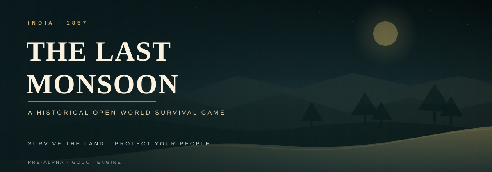
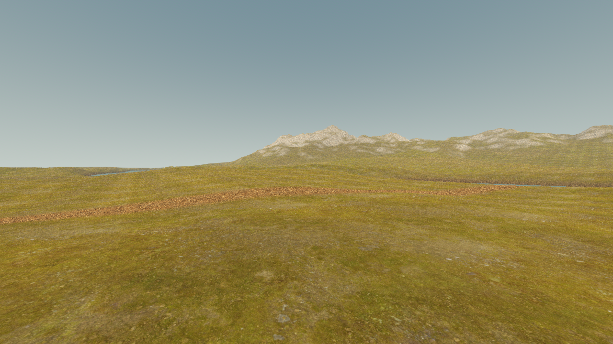
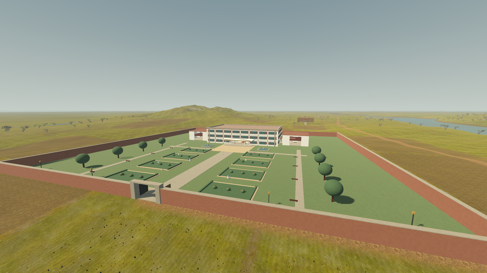

<div align="center">

**A third-person historical open-world survival game · Godot Engine · GDScript**

[](#project-status)
[](#technical-stack)
[](#performance-targets)

[Explore the world](#project-status) · [Run the project](#getting-started) · [Controls](#controls) · [Roadmap](#development-roadmap)

</div>

---

## Overview

**The Last Monsoon** is a third-person historical open-world survival game set in a fictional region of North/Central India during the period surrounding the uprising of **1857**.

You follow **Arjun**, a young villager whose search for his missing brother gradually draws him into a wider conflict involving survival, displacement, resistance, military occupation, local communities, and the changing political landscape.

> **Build a smaller world with meaningful systems before building a larger world with shallow content.**

The project is in **pre-alpha**, focused on reusable gameplay architecture and a playable vertical slice.

> [!NOTE]
> For live task status, failures and the next action, see the [handoff](CODEX_HANDOFF.md). The [docs index](docs/README.md) links to focused system reports and evidence.

---

## Project Status

> [!IMPORTANT]
> **Pre-alpha engineering prototype.** Systems and visual candidates are under active review. The [handoff](CODEX_HANDOFF.md) tracks acceptance and failures; the [docs index](docs/README.md) links to detailed evidence.

### At a Glance

| Area | In the prototype | Under review |
|:---|:---|:---|
| **World** | 2.986 km² Suryagarh landscape, Bhairavpur, civic interiors, Government House | Traversal, visual quality, 8 GB perf |
| **Play** | Movement, survival, river water, riding, combat, map, save/load | Animation, contact, balance |
| **Characters** | Arjun runtime candidate; village + British NPC blockouts | Arjun appearance [rejected](docs/characters/arjun/rejection_2026-09-23.md); NPC motion unapproved |
| **Input** | KB+M; DualSense mappings, settings, feedback; shared Android/iOS touch overlay | Physical controller playthrough; phone builds, touch usability and performance |

### Mobile development update — 8 October 2026

Work has started on bringing the same game to Android phones, iPhone and iPad through a separate touch interface. The first control layer is integrated into the player scene: a left movement joystick, camera dragging on the right, gameplay action buttons, and Bag, Map and Pause controls. The overlay appears automatically in Android/iOS builds and can be enabled for desktop preview. Keyboard and controller controls remain available.

Isolated input checks passed for movement, simultaneous movement and jump, camera limits, button release, and held-input cleanup when menus open or focus is lost. The isolated overlay was also rendered and reviewed with Metal. **This is a control baseline, not a released or verified phone version:** Android/iOS packaging, real-device testing, mobile graphics and loading optimisation, and complete touch gameplay routes remain open. See the [mobile touch baseline](docs/world/mobile_touch_controls.md) for implementation details and remaining work.

### Implemented Systems

<details>
<summary>Core gameplay systems — click to expand</summary>

| System | Status |
|:---|:---|
| Third-person movement | ✅ Implemented |
| Walking / Sprinting / Jumping | ✅ Implemented |
| Gravity + Player collision | ✅ Implemented |
| Spring-arm camera with collision | ✅ Implemented |
| Mouse camera control | ✅ Implemented |
| Android/iOS touch controls | ✅ Basic overlay integrated; phone validation pending |
| Interaction ray + dynamic prompts | ✅ Implemented |
| Reusable interactable architecture | ✅ Implemented |
| Health / Stamina / Hunger / Thirst | ✅ Prototype |
| Exhaustion / Starvation / Dehydration | ✅ Prototype |
| Survival debug HUD | ✅ Prototype |
| Save / Load (3 slots) | ✅ Implemented |
| Title menu + pause menu + settings | ✅ Implemented |
| DualSense vibration / light / gyro | ✅ Implemented |
| Field map with markers | ✅ Implemented |

</details>

---

## Game Vision

The Last Monsoon combines historical fiction, open-world exploration, survival mechanics, systemic gameplay, horse-based travel, NPC relationships, resistance operations, settlement development, faction reputation, environmental storytelling, and dynamic world events.

The game is **not** intended to make the player an unstoppable action hero. Combat, travel, food, water, weather, injuries, relationships and preparation all carry meaningful consequences.

---

## Setting

### Period: 1856–1859

The game exists around the upheaval of 1857 while following fictional characters and events.

### Region: Suryagarh

A fictional region inspired by environments across North and Central India — agricultural plains, forests, river corridors, rocky hills, trading towns, military cantonments, and rural settlements.

```
Suryagarh
├── Bhairavpur Village      ├── Trading Town
├── Agricultural Lands      ├── Suryagarh City
├── Forest Region           ├── Military Cantonment
├── River Settlements       ├── Old Fort
└── Regional Roads          └── Rural Settlements
```

Using a fictional region preserves historical atmosphere without presenting fictional events as documented history.

---

## Protagonist

### Arjun

Arjun does not begin as a resistance fighter — he is an ordinary young man living with his family in Bhairavpur. His older brother **Dev** serves as a sepoy and later disappears.

> **Find Dev.**

His journey gradually exposes him to the expanding conflict and forces him to decide how deeply he is willing to become involved.

---

## Core Design Pillars

### 1 · Survival

The environment creates problems rather than decorating the world — hunger, thirst, health, stamina, exhaustion, injuries, bleeding, disease, temperature, wetness, sleep, food quality, water safety.

### 2 · Exploration

Meaningful discoveries rather than checklists — villages, forests, forts, rivers, temples, markets, caves, hidden trails, resistance camps, cantonments, and abandoned structures.

### 3 · Systemic World

```
Heavy Rain → River rises → Crossing dangerous → Trade disrupted → Village supplies drop
```

### 4 · Survival Before Combat

Fighting isn't always the best solution — hide, retreat, negotiate, disguise, avoid patrols, use alternate routes, wait for night, create distractions.

### 5 · Consequence

Actions influence NPC relationships, settlements, factions, patrol activity, trade, resources, player identity, and story outcomes.

---

## Technical Stack

| | Technology |
|:---|:---|
| Engine | Godot Engine 4.7 (Forward+) |
| Language | GDScript |
| 3D Modelling | Blender |
| Animation | Blender / Godot |
| Version Control | Git + GitHub |

---

## Architecture

The project uses modular, independent gameplay systems:

```
Player
├── PlayerController (input, movement, camera, interaction)
├── SurvivalComponent (health, stamina, hunger, thirst)
├── Interaction (ray, prompt, interactable interface)
├── Combat (melee, rifle, bow, knife)
├── Riding (mount, dismount, horse control)
└── UI (HUD, map, inventory, weapon wheel)

World · Interaction · Survival · Inventory · Items
Characters · AI · Horses · Combat · Factions
Quests · Settlements · Weather · Time
Save System · World Streaming · Developer Tools
```

---

## Controls

| Action | Keyboard | DualSense |
|:---|:---|:---|
| Move | `WASD` | Left Stick |
| Sprint | `Left Shift` | L3 |
| Jump | `Space` | × |
| Interact / Drink | `E` | □ |
| Fill water pouch | `Shift+E` | Hold □ |
| Camera | Mouse | Right Stick |
| Field map | `M` | Touchpad |
| Pause menu | `Esc` | Options |

> [!TIP]
> Settings offer Auto, Keyboard+Mouse, and PS5 DualSense input modes. See the [controller guide](docs/world/animal_tools_and_controller.md) for the full button map and hardware review status.

### Touch controls and desktop preview

Use the left joystick to move and drag the open right side to look. Buttons provide Jump, Use, Ride, Run, Aim, Attack, Reload, Crouch, Prone, Weapon, Stow and Water. Bag, Map and Pause sit at the top right. Hold Run, Aim or Use as needed; Weapon cycles the selected weapon.

To preview the touch overlay from the project directory, launch Godot with:

```sh
godot --path . -- --touch-controls
```

On this Mac, use `/Applications/Godot.app/Contents/MacOS/Godot` if `godot` is not on your PATH. Start or continue the game to see the controls. Desktop mouse emulation supports one finger at a time; simultaneous touch requires a touch device. The preview does not verify phone performance.

---

## Getting Started

### Requirements

- **Godot Engine 4.7** (Forward+ renderer)
- **Git** (with LFS recommended for large assets)
- Blender — only for 3D asset development

### Clone & Open

```bash
git clone <repository-url>
cd TheLastMonsoon
```

Open Godot → **Import Existing Project** → select the project directory → Godot detects `project.godot`.

### Run

| Action | Shortcut |
|:---|:---|
| Launch title menu → Play Game | **F5** |
| Run current scene (e.g. test_world) | **F6** |
| Aerial survey (dev build) | **F3** |
| Landscape review teleport | **F4** |

Press **Esc** in-world to save, load, or change settings. Save files live in `user://saves`.

---

## Screenshots

> These are live captures from the current prototype, not final art.

| Suryagarh river corridor | Government House estate |
|:---:|:---:|
|  |  |

More captures and review status are in the [docs index](docs/README.md).

---

## Development Roadmap

<details>
<summary><strong>Milestone 0–3</strong> — Foundation, Player, Interaction, Survival</summary>

- [x] Project init, repo structure, input config
- [x] Third-person movement, sprinting, jumping, gravity, collision
- [x] Spring-arm camera with collision
- [x] Ray-based interaction, dynamic prompts, reusable interactable
- [ ] Door / Water / Item / NPC / Horse interaction
- [x] Health, Stamina, Hunger, Thirst, Exhaustion
- [ ] Drinking, Eating, Injuries, Sleep, Temperature, Disease

</details>

<details>
<summary><strong>Milestone 4–5</strong> — Inventory, Environmental Survival</summary>

- [ ] Item data architecture, pickups, inventory, weight, stacking
- [ ] Containers, equipment, consumables, horse storage
- [ ] Day/night cycle, weather, rain, campfires, cooking

</details>

<details>
<summary><strong>Milestone 6–7</strong> — Bhairavpur Vertical Slice, Characters</summary>

- [ ] Village blockout, farms, well, river, forest, market, stable
- [ ] Final Arjun model, skeleton, animation controller
- [ ] NPC framework, schedules, relationships

</details>

<details>
<summary><strong>Milestone 8–9</strong> — Horses, Combat</summary>

- [ ] Horse AI, mounting, riding, horse survival stats, trust
- [ ] Melee, blocking, dodging, period firearms, ammunition, enemy AI

</details>

<details>
<summary><strong>Milestone 10–11</strong> — Living World, Story</summary>

- [ ] Wildlife, factions, reputation, dynamic encounters, wanted system
- [ ] Quest/dialogue framework, opening mission, storylines, world-state consequences

</details>

---

## Performance Targets

| Target | Goal |
|:---|:---|
| Primary platform | Desktop |
| Minimum FPS | 30 |
| Preferred FPS | 60 |
| Min-memory design | 8 GB RAM (actual validation pending) |
| Default resolution | 1280 × 720; 1K materials; limited shadows |
| World architecture | Resident tiles + LOD → streamed regions |

---

## Development Principles

- **Systems before scale** — a functioning village beats an unfinished province
- **Gameplay before final art** — prototype geometry until core mechanics prove themselves
- **Modular systems** — features isolated enough to change without cascading breakage
- **Data-driven content** — items, quests, NPCs move toward reusable data definitions
- **Performance by design** — streaming, LOD, pooling, visibility management before world expansion
- **Historical research** — architecture, clothing, weapons, terminology researched before finalizing

---

## Git Workflow

```
main ← stable state
├── develop ← integration branch
├── feature/* ← individual features
└── fix/* ← bug fixes
```

**Commit format:** `type(scope): description`

```
feat(player): add stamina-based sprinting
fix(camera): prevent vertical rotation overflow
docs(readme): modernize layout and add badges
```

---

## Contributing

> The project is under active private development. External contributions are not currently accepted unless explicitly coordinated with the project owner.

---

## Historical Fiction Disclaimer

**The Last Monsoon is a work of historical fiction.** It draws inspiration from real historical periods and environments but uses fictional protagonists, settlements, events, and geography. It is not a substitute for historical scholarship.

---

## License

No open-source license is currently assigned. Source code, original assets, designs, characters, story material, and other original content remain reserved by the project owner. Third-party assets retain their respective licenses.

---

<div align="center">

### THE LAST MONSOON

**Survive the land · Protect your people · Choose what you stand for**

`PRE-ALPHA · ACTIVE DEVELOPMENT · GODOT 4.7`

</div>
