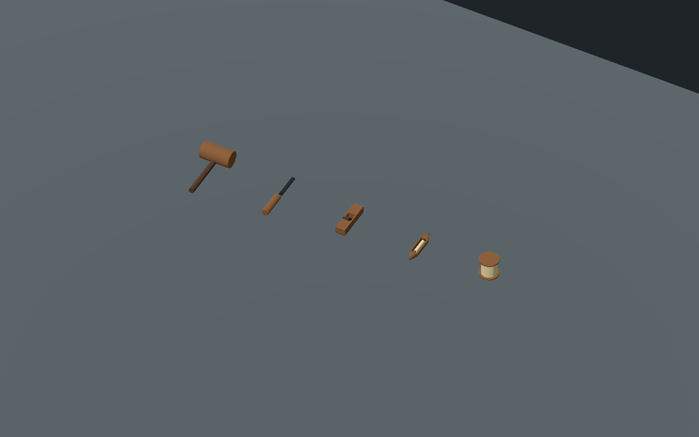
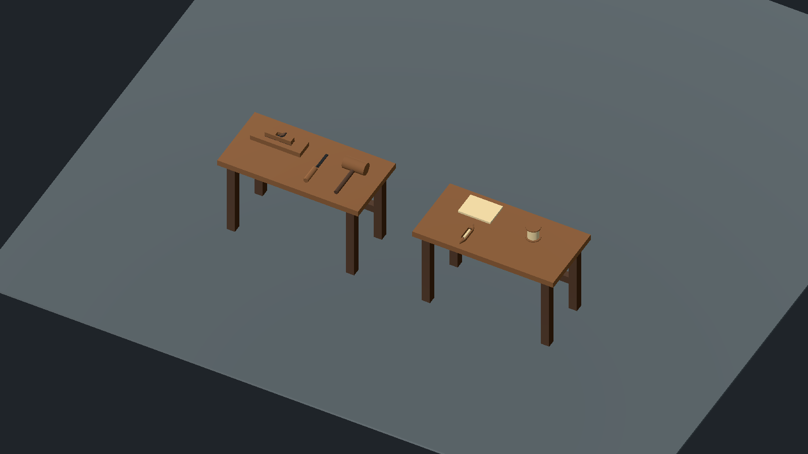

# Craft tools and work surfaces — 2026-10-05 IST

Five reusable tool visuals in `objects/household/craft/`, plus two table assemblies in `objects/household/sets/`. Original editable Godot geometry, rebuilt by `tools/assets/build_craft_batch.gd`. No world placements, NPCs, crafting prompts or rewards added. Existing village context is carpenter house 25 and weaver house 27 in `bhairavpur_house_detail.gd`; their current furniture and loom remain intact.

| Visual | Construction / references | Final action requirements if usable |
| --- | --- | --- |
| `wooden_mallet.tscn` | Wooden cross-head and separate handle. Grip and StrikeFace markers. | Reach/grasp, lift, controlled strike on a specified workpiece, recoil, put down/store; wrist/finger and impact contact. |
| `wood_chisel.tscn` | Metal blade, cutting bevel, tang and wooden handle. Grip/CuttingEdge markers. | Support the workpiece, grasp/angle the chisel, cut or coordinate with mallet, retract/stow. Cutting geometry and material removal need explicit gameplay/visual variants. |
| `wood_hand_plane.tscn` | Wooden body, split sole and open throat, iron and separate retaining wedge. FrontGrip/RearGrip/Grip/CuttingContact markers. | Two-hand placement, press/push across supported timber, lift/return, shavings if cutting is enabled; palm/sole/tool alignment and plank restraint. |
| `weaving_shuttle.tscn` | Tapered wooden tips and side rails, open bobbin seat with spindle and yarn. Grip/ThreadExit markers. | Pass/throw/catch through an actual loom shed; maintain yarn ownership/tension; synchronize loom treadle/heddle and beat action when weaving is enabled. No loom mechanism added here. |
| `yarn_spool.tscn` | Core, separate top/bottom flanges and yarn body. Grip/ThreadExit markers. | Pick up, hold/unwind/thread and return; actual thread line/tension and spool rotation if supported. Decorative stock needs no hero animation. |

`carpenter_work_surface.tscn`: 1.30 × 0.65 m table, 0.78 m top, four legs/rear brace, workpiece, plane, chisel and mallet. Plane aligns with the workpiece's long axis and rests at its 0.825 m top.

`weaver_work_surface.tscn`: same table and support height, shuttle, upright spool and folded cloth. Shuttle is separated from the cloth footprint. Both have Approach and WorkContact markers; each tool remains a separate shared instance so it can later attach to a hand. Table members have box collision; tool visuals are script/collider-free, intended to be attached to future interaction wrappers. Workpiece/cloth remain decorative visuals.

Final-pass interaction checklist: standing/seated approach, weapon stow, grip/attachment, manipulation, exact resource/reward transfer if any, safe return/stow, cancellation, inventory/save behavior and normal-speed palm/finger/sole contact. No craft state, consumable materials or rewards are implied by the models.

Review tool: `tools/assets/review_craft_batch.gd`. Headless/native Metal PASS for seven scene loads, nonempty positive floor bounds, grip/approach references, two tabletop collision hits at 0.78 m and two clear capsule approaches. Reports `craft_validation_headless.json` and `craft_validation_metal.json`. Native tools/assemblies and close shuttle/plane views inspected; four current captures demonstrate distinct evidence. Superseded captures of these same views overwritten. Structural tests do not approve hand contact, world routes, period form or final appearance.

Remaining: wood grain/wear, blade sharpening/retention detail, believable yarn winding and period/art approval; world integration beside the existing workshop/loom with route checks. No human source or export modified. Next batch: reusable weapon-rack dressing/refinement using existing weapon models; hero animations stay last.
