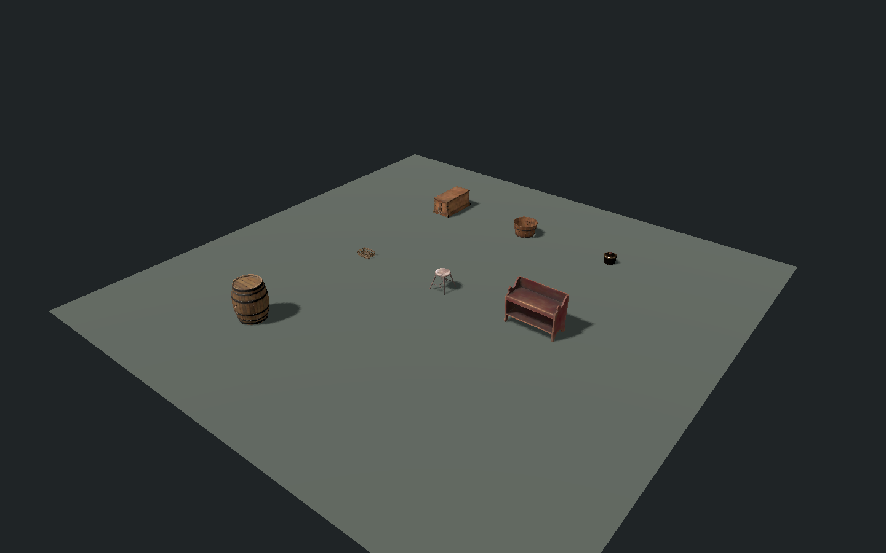

# Household batch 03 — furniture and storage

2026-09-30 IST. **REUSABLE SCENES BUILT / ART APPROVAL OPEN / HERO ANIMATIONS DEFERRED**.

The seven existing textured models were retained. `storage_source_audit.json`: all 35 package files match the recorded SHA-256 values in `docs/world/period_prop_manifest.json`; no source mesh/texture was changed or downloaded. The manifest records CC0 provenance. Exact regional/1857 suitability remains separate from the licence and rendering checks.

## Asset library

Reusable scenes are under `objects/household/storage/`. Each references the existing imported source scene once, normalizes the visible base to Y=0, carries `solid_period_prop`, and includes static collision. `settlement_builder.gd` now places these shared scenes at the same seven world coordinates and names used before.

| Scene | Source triangles | Result / future action requirements |
| --- | ---: | --- |
| `crate.tscn` | 5,176 | Fixed X/Z collider orientation: visible crate is 0.53 m wide × 1.17 m deep; collider is 0.55 × 0.50 × 1.17 m. Top reference. Opening would require separate lid/hinge targets and open/search/close motion; not enabled. |
| `bucket.tscn` | 7,252 | Wood/metal source retained; grip/opening reference markers. Carry, dip/draw and pour motions only if interaction is later enabled. |
| `brass_pot.tscn` | 3,760 | Lidded decorative brass vessel. This is separate from the interactive earthen water pot. Future lid handling/carry/pour needs actual grips and removable parts. |
| `basket.tscn` | 22,276 | Woven low basket and rim references. Lift/carry/place only if enabled. Dense weave needs a later LOD/performance pass before widespread repetition. |
| `stool.tscn` | 10,946 | Seat/approach reference markers. Sit/get-up and planted feet pending; currently decorative. Seat centre/height markers need final rig contact review. |
| `bench.tscn` | 630 | Two seat/approach reference markers. Sit/get-up and optional seated idles pending; currently decorative. |
| `barrel.tscn` | 10,820 | Banded barrel source retained. Top reference. Carry/roll/open/pour tasks not enabled; future capability would require matching parts and weight-aware motion. |

Markers are authoring references, not approved handholds or seated poses. No usable prompt or new inventory capability was added to these static objects.

## Evidence

Build/review: `tools/assets/review_storage_batch.gd`; pass `-- --build` to rebuild the wrappers. Packing preserves ownership of source-instance children so mesh geometry is not duplicated.

- `storage_validation_headless.json` and `storage_validation_metal.json`: all seven visible bases at zero studio floor gap; fourteen front/back capsule contacts PASS. Clean final fixture exits. Initial packing duplicated geometry and leaked resources at shutdown; ownership fix removed both, with original triangle counts restored.
- `storage_overview.png` and `storage_{crate,bucket,brass_pot,basket,stool,bench,barrel}.png`: fresh Forward+/Metal review. Geometry/materials, lid/rim/weave/feet and floor contact inspected. Crate framing and studio ambient light corrected after first capture.
- Main-world `tools/world/validate_period_props.gd`: seven support checks PASS, gaps -0.0000005 to 0 m. World load also reported missing imported skeletons for concurrent `FortCook`/`FortSteward` actors. These are unrelated to the wrapper assets; this is not a clean whole-world approval.
- Main-world sprint/route rerun: `/tmp/tlm_storage_routes_20260930.log`; final five checks PASS (`docs/world/period_prop_route_validation.json`). Shutdown retained two ObjectDB instances/one resource in the full world; not a clean whole-world exit. First reruns: bucket/pot/basket sprint and village aisle PASS; compound route stopped on `BodyCollider`, without touching props. The old goal at Z=274 overlaps the now-solid sergeant in `british_npc_roster.gd`. Prop-clearance fixture now ends at Z=272 before his footprint; it does not disable NPC collision or claim the original occupied endpoint is clear. No world art/traversal approval is inferred from studio checks.

Limitations: source/model appearance is still subject to owner art review; exact historical form, widespread-instance performance/LOD, all-side jump/crowd contact and final hero use remain open. Existing simple bench/stool collision envelopes do not model the gaps between furniture legs.

Next asset batch: small paper/clue/supply props. Character animation work stays in the final pass per owner direction.

