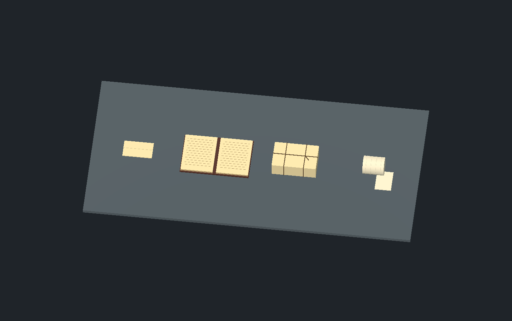

# Paper and supply props — 2026-10-01 IST

Four reusable visual candidates in `objects/household/supplies/`. This batch follows ease of production, not story order. No complete story object list has been supplied; correspondence and ruled records are generic, with no invented clue text. No new usable prompts or rewards were added.

| Prefab | Construction / integration status | Final animation requirements |
| --- | --- | --- |
| `folded_letter.tscn` | 18 × 11.5 cm folded paper; separate opening flap and crease. Story text and placement open. | Table/ground reach, grip/lift, unfold/read/refold, satchel storage and retrieval; pickup transfer at visible contact. Flap needs pivot/deformation setup before animation. |
| `record_folio.tscn` | Open 42 cm folio, covers, spine, page blocks and blank ruled sheets. Story content and placement open. | Approach/read, support both sides, page turn if enabled; collection only if specified. Current blocks need deformable turning pages and closing rig. |
| `supply_parcel.tscn` | 27 × 18 × 8.5 cm paper parcel, crossed twine and tie tail. Contents/reward and placement unassigned. | Grip/lift/store; if opening is enabled, hold, untie, unfold wrapper and transfer contents. Twine/wrapper need motion-ready rig or variants. |
| `bandage_roll.tscn` | Reusable copy of existing medical supply mesh; winding seams and loose strip. Existing medical pickup remains in place with its behavior. | Retrieve from satchel, grasp loose strip, wrap supported wound location, secure/stow; coordinate healing timing, interruption and remaining cloth. Existing cosmetic prototype does not close contact review. |

All have named left/right grip markers; letter has FlapGrip, folio PageTurnGrip/ReadingTarget, parcel TieGrip, bandage LooseStripGrip. These are reference positions, not verified hero hand contact. Scenes are visual-only so they can be attached to hands or used inside pickups without duplicate scripts/colliders. Add placement-specific collision and interaction components at integration.

Original code geometry; bandage derived from the repository's original `medical_supply.gd`. Builder: `tools/assets/build_paper_supply_batch.gd`. Review: `tools/assets/review_paper_supply_batch.gd`. Headless and native Metal PASS for saved scene instantiation, nonempty visual bounds, floor baseline, grip markers and absence of gameplay scripts. Reports: `paper_supply_validation_headless.json`, `paper_supply_validation_metal.json`; captures: `paper_supply_overview.png` and four individual `paper_supply_*.png` views. Floor correction raises the copied bandage seams 2 mm. Native appearance reviewed as basic candidates; material ageing, paper edge detail, period/art approval, placement and normal-speed motion remain open. No claim of final animation-ready topology or whole-world approval.

Next batch: assembled cooking, bedding, market/craft and desk/armoury sets, starting with small reusable set arrangements. Character animation remains in the last pass.
