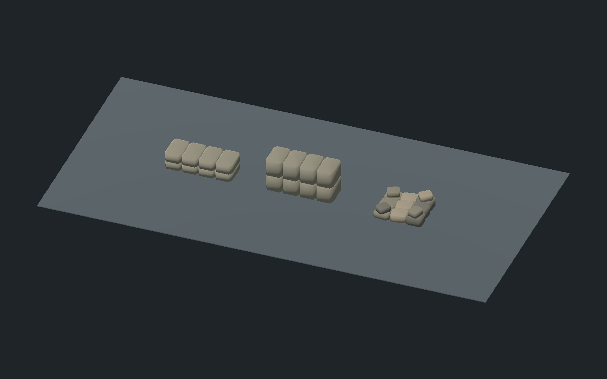

# Ledge and rubble candidates — 2026-10-05 IST

Three original reusable scenes in `objects/obstacles/`. No world placement or hero animation changed in this batch.

| Scene | Model and collision | Required final animation/contact work |
| --- | --- | --- |
| `low_stone_ledge.tscn` | 1.80 × 0.76 × 0.45 m, eight beveled stones, 480 triangles. Per-stone convex hull collision matches the mesh vertices. | Step/climb variant if enabled: supported takeoff, sole placement on the top, weight transfer, planted recovery. Palm contacts only if that action needs hands. |
| `waist_stone_ledge.tscn` | Same footprint, 0.90 m tall, 480 triangles. Two stone courses with continuous center top support. | Approach, weapon stow, reach/plant palms, pull or mantle, move pelvis/legs clear, land/recover. Fit to accepted hero rig and existing climb controller. |
| `stone_rubble.tscn` | About 1.31 × 1.16 × 0.40 m; thirteen varied stones, 780 triangles. Four upper stones sit on supporting base stones; each stone has its own convex collision. | No animation for decorative rubble. Walking/step-over if traversable needs uneven sole contact, obstacle clearance and recovery; collecting stones is unsupported. |

Both ledges include `LeftPalm`, `RightPalm`, `LeftSole`, `RightSole`, `TopClearance`, `Landing`, and `Approach` markers. Rubble has `Approach` and `StepOverReference`. Markers are geometric references, not verified hero contact. No new prompts, loot, climb registration or cover behavior are added.

Builder `tools/assets/build_ledge_rubble_batch.gd`; reviewer `tools/assets/review_ledge_rubble_batch.gd`. Headless and Metal PASS: saved scene loading, nonempty/floor-normalized mesh bounds, three solid collision rays, eight ledge top-support samples within 2 mm, and three clear capsule approach points. Reports: `ledge_rubble_validation_headless.json` and `ledge_rubble_validation_metal.json`. First native render exposed inward surface winding despite collision passing; winding was reversed and the same captures replaced. Latest overview inspected with solid visible surfaces. Four current captures retain distinct overview and individual model views; superseded pixels were overwritten.

Original deterministic code geometry, no external source dependencies. Scenes are editable in Godot and rebuildable from the retained scripts. No humans created. Final stone material ageing, less regular broken-stone silhouettes, period/art approval, world support/route integration, moving hero contact and final animation review remain open. Structural passes do not close these gates.

Next easiest batch: craft tools and work-surface dressing using the existing carpenter/weaver context. Placement of ledges/rubble should use surveyed ruin/service-yard locations and controller route checks. Animations remain last.
