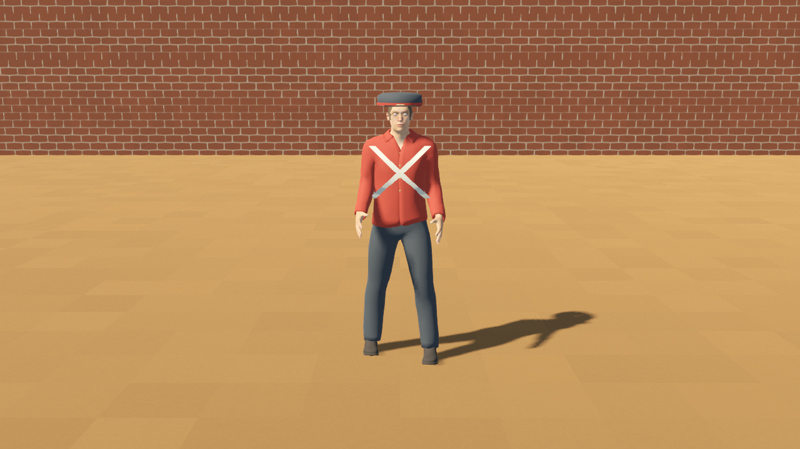
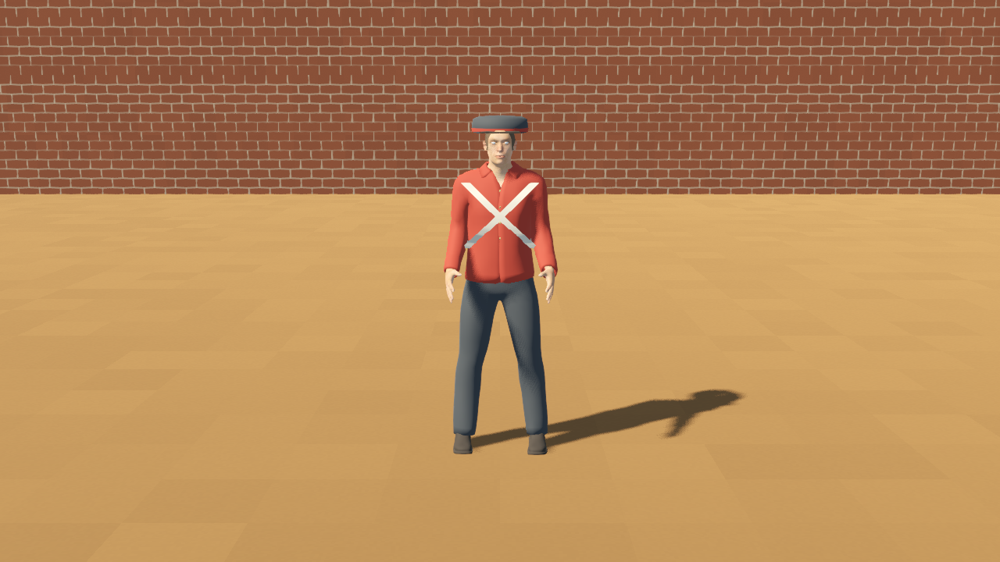
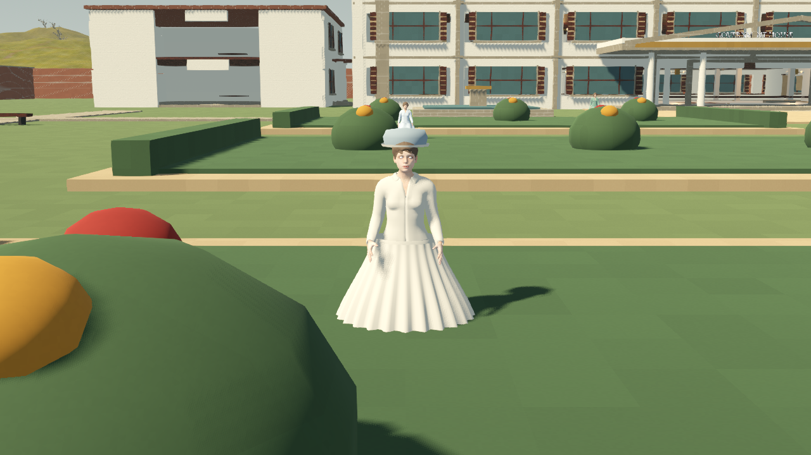
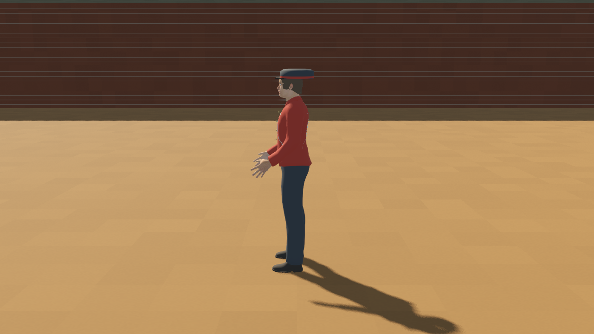
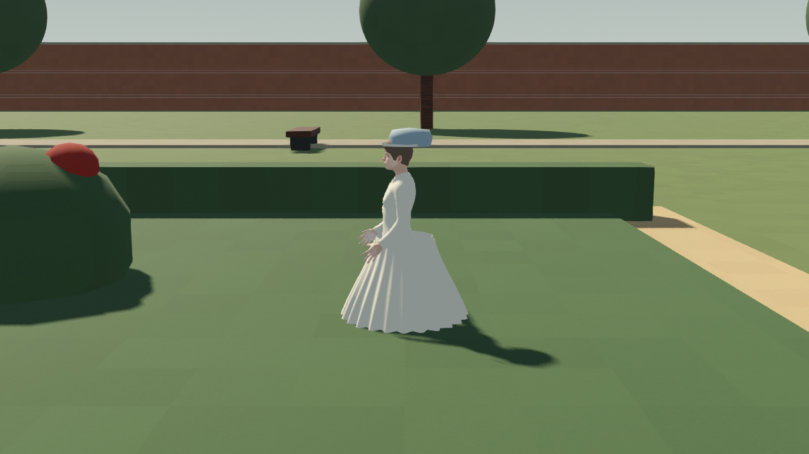
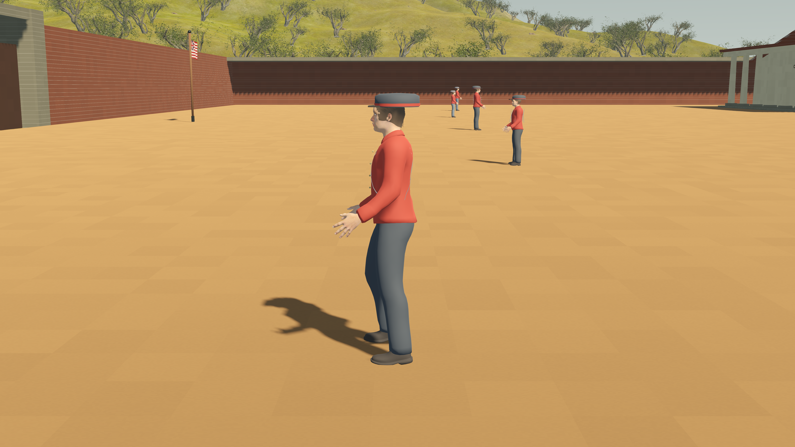
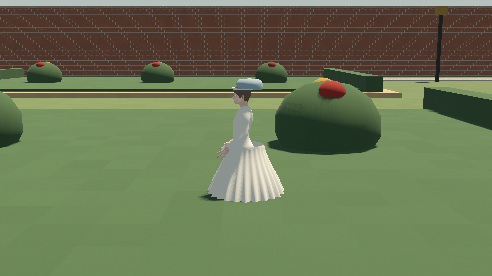
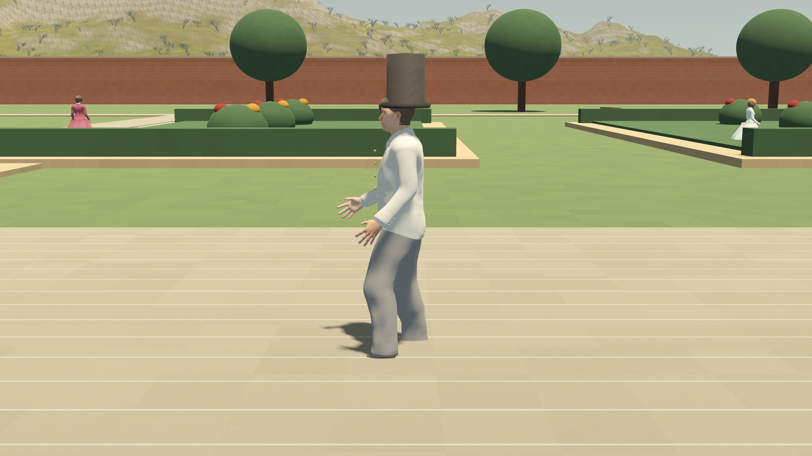

# British NPC AnimationTree

## Implemented

Each of the sixteen independent actors creates its own `PersonalAnimationTree`, graph and animation resources at runtime. The existing personal AnimationPlayer supplies the idle/walk clips; AnimationTree owns playback. Male and female walk duration and stride profiles are retained.

Graph: **idle → locomotion Blend2 ← walk TimeScale ← walk; locomotion → output**.

`parameters/locomotion/blend_amount` is driven by the actor's patrol state. Starting and stopping move the blend across 0–1 over 0.2 seconds. Each tree advances manually once per actor update, keeping movement and animation on the same time step. Disabling `movement_enabled` freezes that actor’s travel while its tree fades to idle. No direct AnimationPlayer.play calls are used for live locomotion.

The graphs are created by `characters/npcs/british/british_npc_actor.gd`; inspect PersonalAnimationTree in the remote scene while running. They are separate runtime graphs rather than shared scene resources.

## Verification

[Tree validation](candidates/animation_tree_validation.json) PASS: sixteen distinct active trees and graphs, actual thigh pose playback on all sixteen, half/full start blend, half/zero stop blend, idle pose recovery and independent stop. Existing clip/facing/arm checks and full-world surveyed placement also PASS.

Fresh Metal captures below exercise tree evaluation at idle, intermediate blend and walk. Images establish representative pose appearance; normal-speed foot contact and cloth approval remain open.

### Private Man

### Private Woman

## Remaining limits

The tree blends the existing preview clips. It does not add navigation, root motion, combat, gestures or cloth simulation. Skirts remain stiff and feet may slide; the torso straps, tailoring, equipment and period materials remain candidates. Motion and realism work can extend the graph after the base clips are approved.

Tools: `tools/characters/validate_british_animation_tree.gd`, `tools/characters/capture_british_animation_tree.gd`. The older walk-phase capture tool explicitly disables the tree to examine source clips; it is not evidence of live tree playback.

## Walk clip refinement

The clips now convert skeleton-space pitch/yaw into each bone's posed local axes. This removes the earlier sideways leg swing from imported bone rolls. Knee flexion, small elbow flexion and ankle counter-rotation are included; male/female stride amplitudes remain separate.

[Full-cycle gait validation](candidates/gait_validation.json) PASS for all sixteen actors: 65 samples per actor through the live tree, forward ankle swing 0.172–0.406 m, lateral drift below 0.000001 m. Vertical ankle travel is 0.018–0.043 m. These measurements are skeleton paths, not proof of mesh sole clearance, stride-speed matching or planted feet. Foot locking and normal-speed contact still need refinement.

Side-view tree evidence:

## Travel-speed cadence

A walk-only TimeScale now drives cadence. Each rig is calibrated by sampling its actual ankle excursion across one cycle; estimated natural speed is twice that excursion divided by clip duration. Live cadence is travel speed divided by that estimate (bounded to 0.1–3). Idle breathing is outside this rate node. Placement offsets are initialized before measuring travel so the first frame does not cause a cadence spike.

[Cadence validation](candidates/cadence_validation.json) PASS for all sixteen: measured travel matches nominal speed × playback rate, half-speed travel produces half cadence, and stopping reaches idle with zero travel. Existing tree transition/independence and world placement checks pass again. This is an excursion-based estimate, not stance-foot locking; residual sliding, sole contact and skirt motion still need review.

Representative Metal poses after 45 live actor updates at 60 Hz:

## Flat-ground foot planting

A per-actor two-bone stance solver now runs after tree evaluation (`characters/npcs/british/british_foot_plant.gd`). The stance ankle is held at a world target while the swing ankle clears the surveyed flat grade. A 5.5 cm hip drop blends with locomotion to preserve knee reach; ankle orientation comes from the clip. Locks release during idle and reset when facing changes. Mid-stride restarts choose a target within the remaining stance stroke.

[Full patrol foot-plant validation](candidates/foot_plant_validation.json) PASS: 610 updates per actor through outward walk, idle, return and restart, 218 locked samples each; maximum ankle-target error below 0.000001 m, no reach-limited frames and no swing ankle below its reference height. Separate tree clip tests disable this correction to verify underlying playback independently.

This validates ankle targets on the current flat plots. Mesh sole clearance, uneven ground, turn popping, normal-speed visual continuity and cloth remain unapproved. The refreshed male live cadence screenshot includes the final correction and shows a crouched/stiff gait requiring refinement. Female/official captures are from the earlier stance pass; the final capture stalled after the male view and was stopped. `foot_plant_enabled` can disable the correction per actor for clip comparison.

## Adaptive hip clearance follow-up

The fixed 5.5 cm walking hip drop is replaced by a reach calculation for the stance and swing targets. The pelvis is restored before each tree evaluation, preventing the previous correction from affecting the next frame's target calculation. Across the full patrol, men now need 0.8–2.4 cm and women 0.8 cm of hip drop, while all sixteen still hold stance targets without reach-limited frames. Tree transition and idle recovery checks pass again.

Fresh male, female and official Metal cadence views completed and were inspected. The male pose is more upright than the fixed-drop version. Hands still read stiff/open, skirts remain rigid, and snapshots do not approve normal-speed turn/contact continuity. The earlier capture-stall note above records the prior run; this fresh run completed all three views.

## Hand pose and patrol reversal

The hand preview now applies a small curl to the imported finger joints after the tree update; forearms bend slightly back toward the body. The [tree validation](candidates/animation_tree_validation.json) confirms actual relaxed finger poses on all sixteen, along with the earlier playback and independent stop checks. Close [male](candidates/private_man_hands_world.png) and [female](candidates/private_woman_hands_world.png) Metal views were inspected. Fingers look less spread, but the hands still need tailored art/skin review.

At the outer patrol endpoint, each NPC now turns in place for 0.5 s before moving back. [Turn validation](candidates/turn_validation.json) PASS on all sixteen: no root translation during the turn, completed 180° facing, then the expected first return step. Foot-plant and tree checks pass after the change. [Male](candidates/private_man_turn_world.png) and [female](candidates/private_woman_turn_world.png) mid-turn snapshots show the current geometry; they do not prove continuous turn contact. The skirt waist gap is especially visible in the female view.
