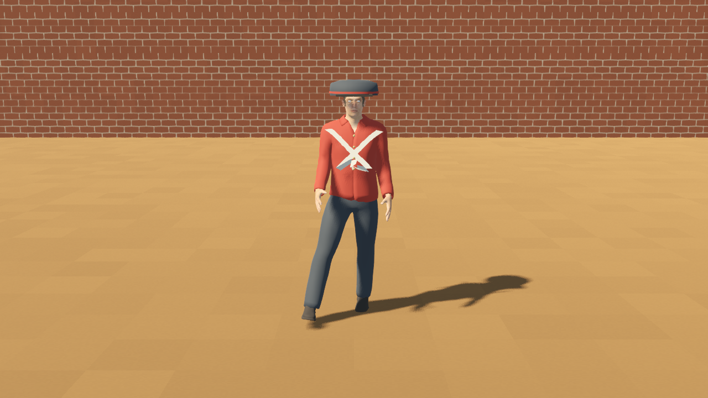
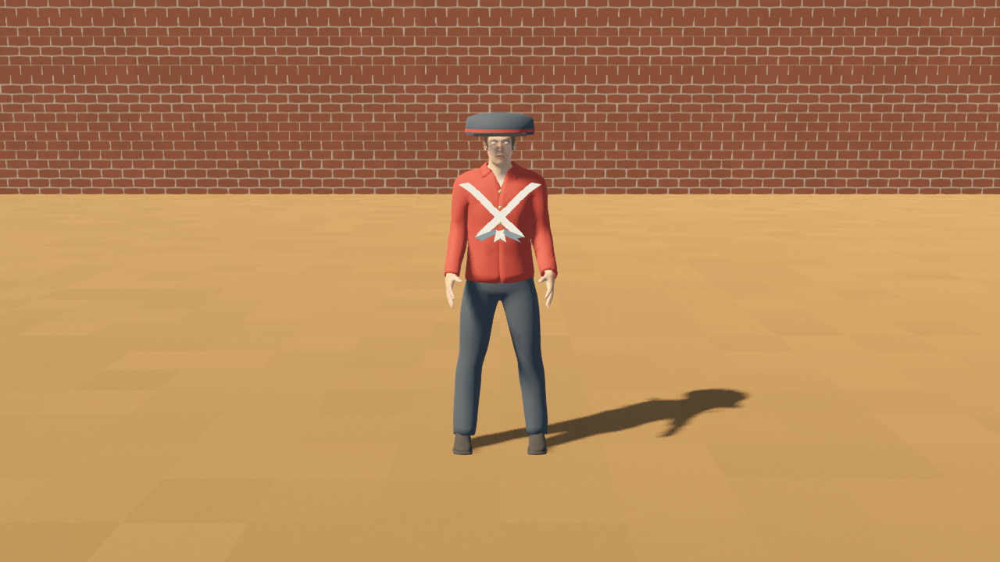
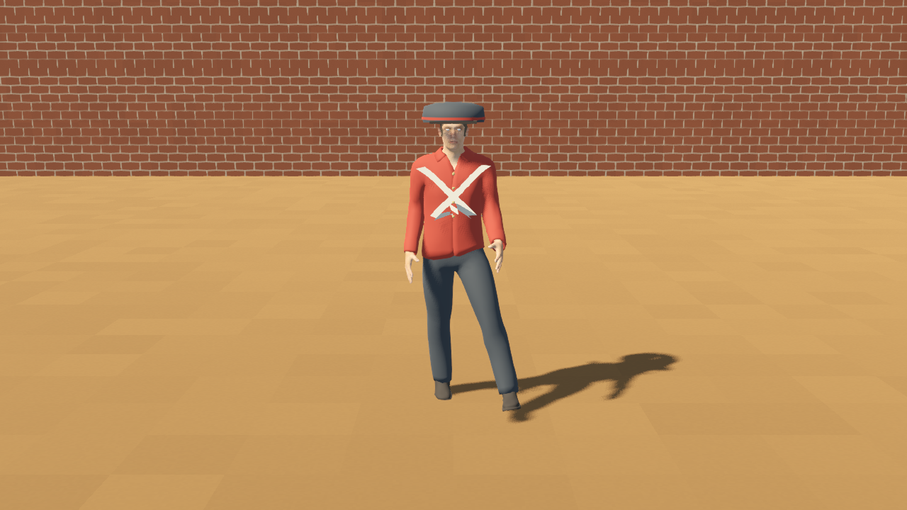
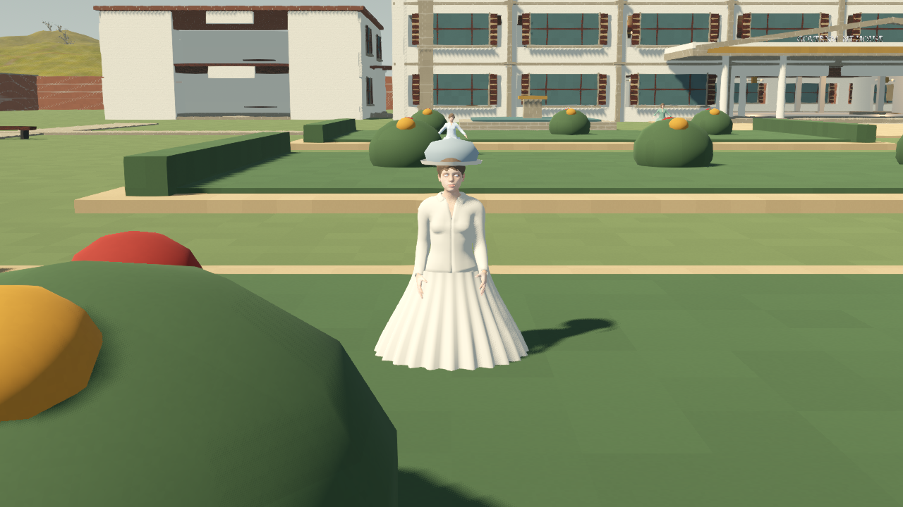
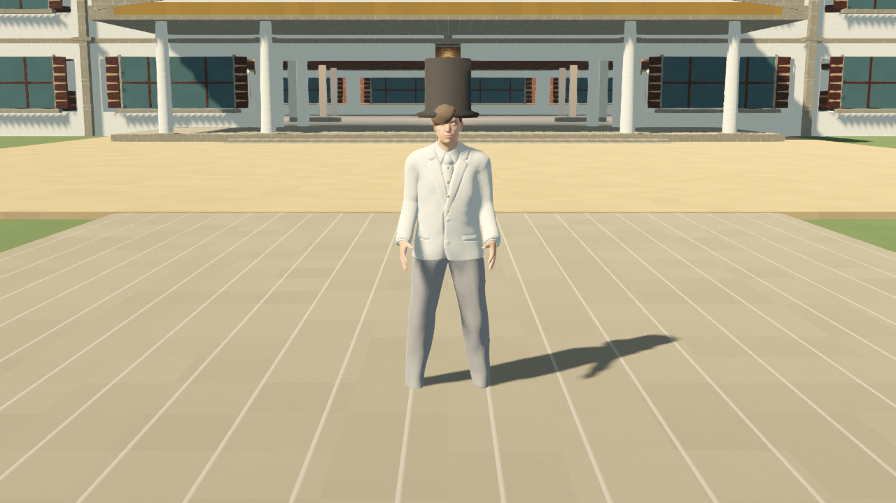
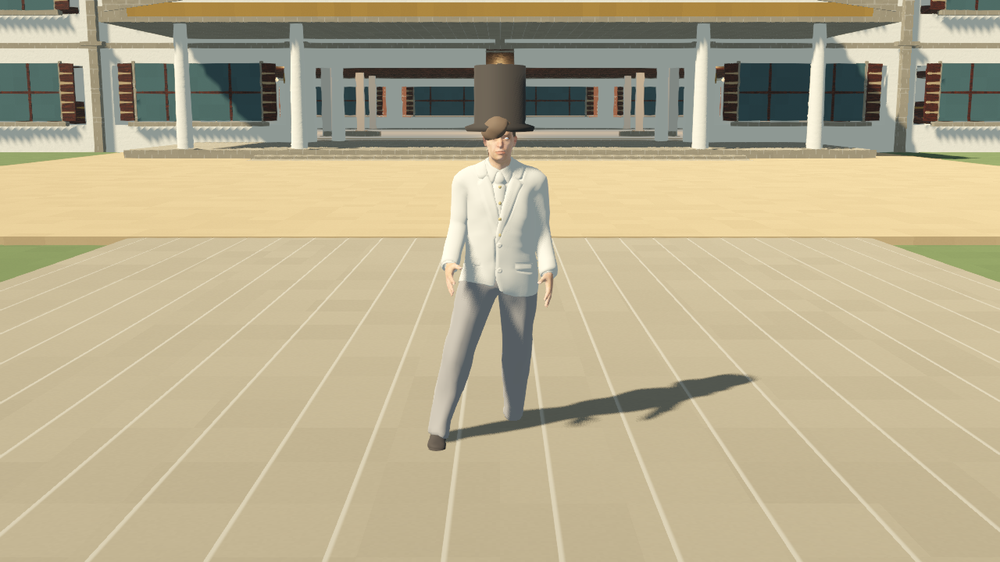
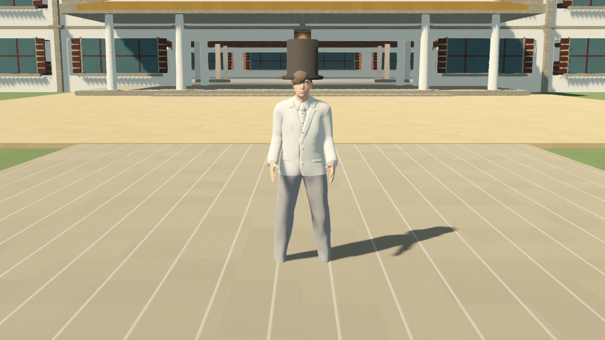
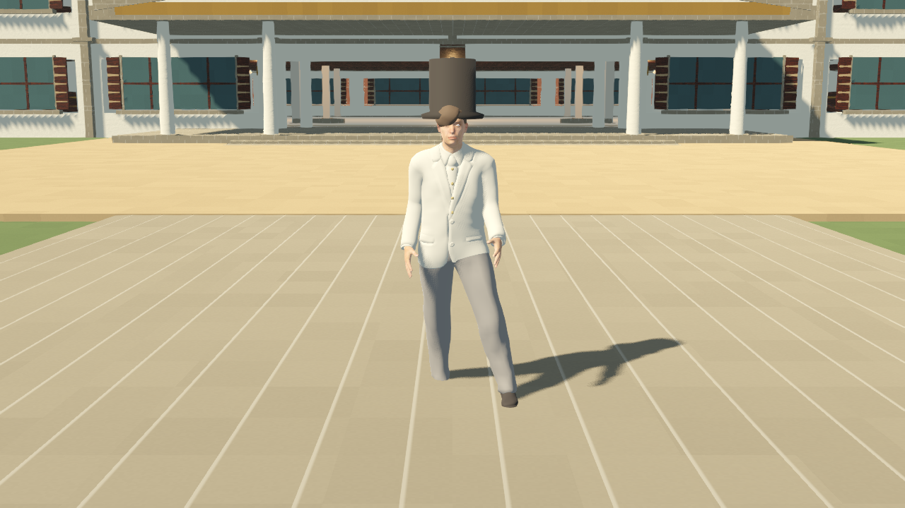

# British NPC base and motion analysis — 27 September 2026

## Current result

Sixteen separate runtime models are present: eight men and eight women. Existing editable MPFB sources and turnaround renders were retained. Each actor has its own skeleton, AnimationPlayer, idle clip, walk clip, clock, movement switch and patrol position. There is no paired movement dependency.

Seven military men are placed in the Company compound. The civil official and eight independently placed women are in the Government House grounds. Reference pair names remain asset provenance; they assign no relationship, occupation or rank to women.

## Movement and checks

Male and female walk profiles use different cycle lengths (0.85 and 1.05 seconds) and stride/arm amplitudes. Every actor owns a separate sampled animation resource. Base behavior is a short out-and-back walk with idle pauses and individual timing offsets. Setting movement_enabled to false stops that actor and plays its idle.

- [Runtime validation](candidates/roster_runtime_validation.json): PASS, 16 independent animation players, 8 male and 8 female profiles, actual thigh pose changes on all 16, independent stop test PASS.
- [World validation](candidates/roster_world_validation.json): PASS, 16 models loaded with one skeleton each and positions inside surveyed plots.
- These are preview patrols. Navigation, collision avoidance, dialogue, combat and story behavior are not implemented by this actor.

## Rendered review

Body and garment masks are baked in the export rest pose, preserving skinning. Procedural fabric colors are simplified for GLB. Fresh representative Metal walk-phase captures show the private man, private woman and official without the earlier severe body breakthrough. Earlier pair world captures record failed exports and are superseded for this comparison.

The earlier capture encountered a concurrent landscape load failure. The subsequent world validation loaded successfully; the refreshed capture run is the current evidence. Placement checks alone do not approve visual ground contact.

### Private Man walk phases

### Private Woman walk phases

### Official Man walk phases

## Asset inventory

| Concept source | Editable source | Turnaround | Separate runtime models |
| --- | --- | --- | --- |
| Private | [Blender](../../../WorkingAssets/NPCs/british/private_pair/private_pair_mpfb_candidate.blend) | [Front](candidates/private_pair_front.png), [side](candidates/private_pair_side.png), [back](candidates/private_pair_back.png) | private_man.glb / private_woman.glb |
| Corporal | [Blender](../../../WorkingAssets/NPCs/british/corporal_pair/corporal_pair_mpfb_candidate.blend) | [Front](candidates/corporal_pair_front.png), [side](candidates/corporal_pair_side.png), [back](candidates/corporal_pair_back.png) | corporal_man.glb / corporal_woman.glb |
| Sergeant | [Blender](../../../WorkingAssets/NPCs/british/sergeant_pair/sergeant_pair_mpfb_candidate.blend) | [Front](candidates/sergeant_pair_front.png), [side](candidates/sergeant_pair_side.png), [back](candidates/sergeant_pair_back.png) | sergeant_man.glb / sergeant_woman.glb |
| Lieutenant | [Blender](../../../WorkingAssets/NPCs/british/lieutenant_pair/lieutenant_pair_mpfb_candidate.blend) | [Front](candidates/lieutenant_pair_front.png), [side](candidates/lieutenant_pair_side.png), [back](candidates/lieutenant_pair_back.png) | lieutenant_man.glb / lieutenant_woman.glb |
| Captain | [Blender](../../../WorkingAssets/NPCs/british/captain_pair/captain_pair_mpfb_candidate.blend) | [Front](candidates/captain_pair_front.png), [side](candidates/captain_pair_side.png), [back](candidates/captain_pair_back.png) | captain_man.glb / captain_woman.glb |
| Major | [Blender](../../../WorkingAssets/NPCs/british/major_pair/major_pair_mpfb_candidate.blend) | [Front](candidates/major_pair_front.png), [side](candidates/major_pair_side.png), [back](candidates/major_pair_back.png) | major_man.glb / major_woman.glb |
| Colonel | [Blender](../../../WorkingAssets/NPCs/british/colonel_pair/colonel_pair_mpfb_candidate.blend) | [Front](candidates/colonel_pair_front.png), [side](candidates/colonel_pair_side.png), [back](candidates/colonel_pair_back.png) | colonel_man.glb / colonel_woman.glb |
| Official | [Blender](../../../WorkingAssets/NPCs/british/official_pair/official_pair_mpfb_candidate.blend) | [Front](candidates/official_pair_front.png), [side](candidates/official_pair_side.png), [back](candidates/official_pair_back.png) | official_man.glb / official_woman.glb |

## Later realism and motion pass

The base is functional and remains a candidate. Walk arms retain an outward rest-pose bias. Skirts remain stiff; feet may slide because translation is a timed patrol rather than foot-locking. Normal-speed full-cycle contact review is still required. Hair, faces, headwear, belt thickness and attachment, modern donor garment seams, skirt joins, sword attachment and exact period insignia need refinement. Representative phase images do not establish that every costume deforms correctly.

Runtime code: characters/npcs/british/british_npc_actor.gd and world/suryagarh/british_npc_roster.gd. Sources retain the original paired editing layout; runtime models and actors are independent. No final realism or historical approval is claimed.
